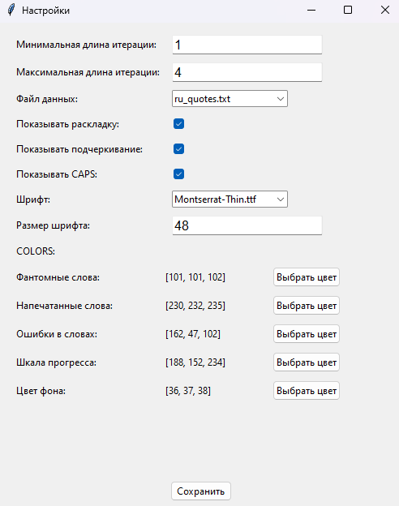
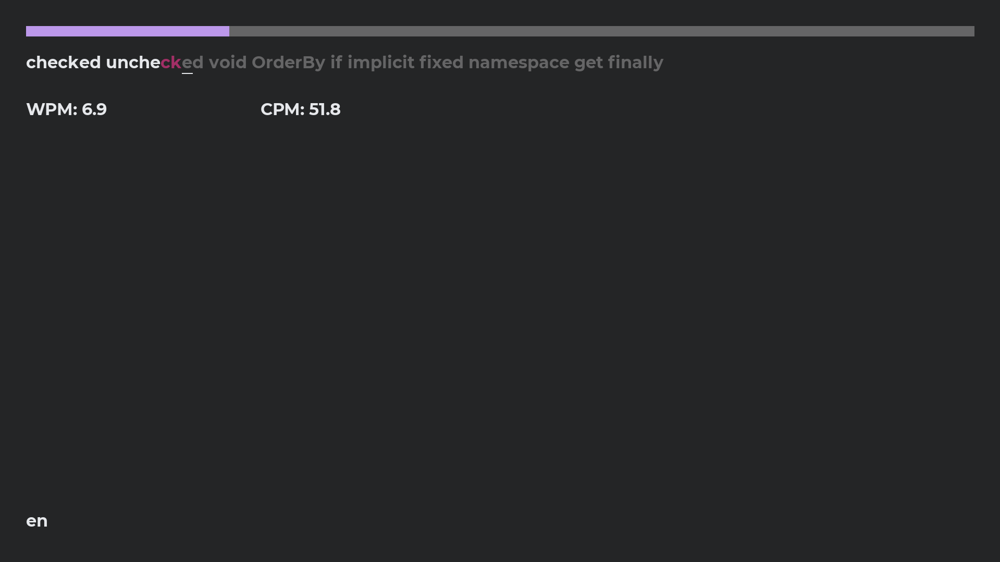
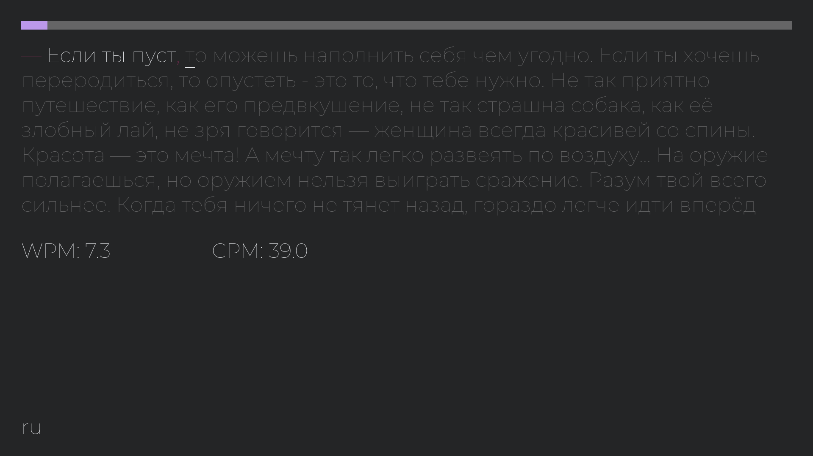

# BlindTyper

## Описание
**BlindTyper** - это приложение, которое позволяет пользователям загружать свои наборы строк для тренировок в наборе текста. Оно предоставляет возможность настроить внешний вид интерфейса, чтобы обеспечить комфортное использование.

## Функции
Загрузка пользовательских строк: 
- Импортируйте свои наборы строк для тренировок.
- Настройка интерфейса: Персонализируйте внешний вид приложения в соответствии с вашими предпочтениями ( возможна подгрузка своего шрифта, изменение цвета ).
- Тренировка набора текста: Улучшайте свои навыки слепой печати с помощью ваших собственных текстов.

## Установка
```bash
git clone https://github.com/DmitryAce/blindtyper
```
### Linux
- `cd blindtyper/linux/`
- `chmod +x blindtyper`
- `chmod +x settings`
## Использование
В зависимости от вашей операционной системы используйте соответствующую дирректорию в репозитории.

> Не нарушайте целостность дирректорий ( fonts/ stringsets/ ) внутри *windows*/ *linux*/ для корректной работы приложения

Свои шрифты можно добавлять в `fonts/`    
Свои файлы с текстом можно добавлять в `stringsets/` - Приложение считывает уникальные строко построчно

### Windows
Для изменения конфигурации используйте `settings.exe`   
Для запуска приложения используйте `blindtyper.exe`  
Выход из приложения `alt+f4`

### Linux
Для изменения конфигурации используйте `./settings`   
Для запуска приложения используйте `./blindtyper`    
Выход из приложения `alt+f4`

## Обзор
Когда строка закончится, она сраузе же обновится и сделает случайный набор строк количеством от n до m из выбранного вами файла (всё можно настроить).    
   
*Montserrat-Bold size:32*
   
*Montserrat-Thin size:48*
   